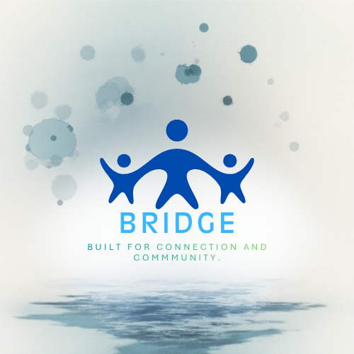
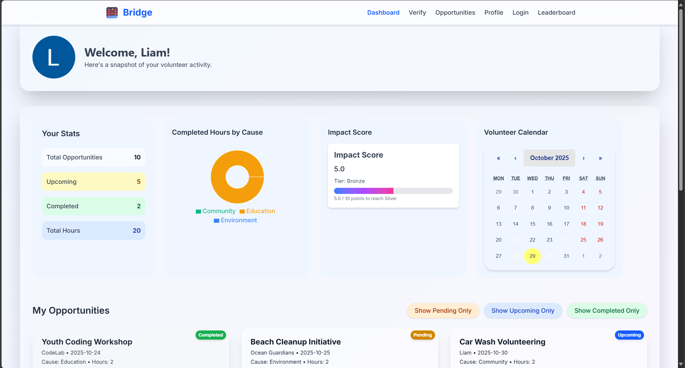
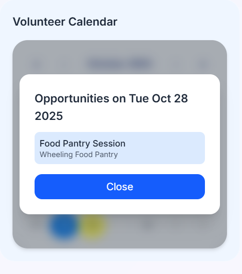
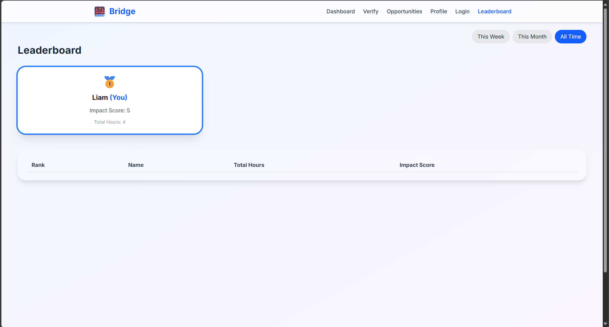

# Bridge – Volunteer Opportunities App

  
*Connecting volunteers to opportunities and tracking community impact.*

  
  
  

---

## Overview

**Bridge** is a web app designed to help volunteers discover, track, and showcase their community service. Users can sign up for opportunities, submit proof of participation, and visualize their volunteer contributions through an interactive dashboard and calendar.

**Key Features:**

- **Dashboard:** Track total hours, completed and upcoming opportunities, and your impact score.  
- **Opportunity Management:** Browse and sign up for volunteer events, submit proof for verification.  
- **Volunteer Calendar:** Interactive calendar to visualize scheduled activities.  
- **Leaderboard:** Compare your contributions with other volunteers, with medals for top contributors.  
- **Impact Score:** Points system: 1 hour = 1 point, featured opportunities ×1.5.
- **AI Assistant** AI Assistant that can help with either organization or user questions.
- **Responsive Design:** Smooth animations and friendly layout.  

---

## Screenshots

  
*User dashboard with stats, calendar, and impact score.*

  
*Interactive calendar displaying signed-up opportunities.*

  
*Leaderboard showing top volunteers and their impact scores.*

---

## Technology Stack

- **Frontend:** Next.js, React, Tailwind CSS, Framer Motion  
- **Backend:** Supabase (PostgreSQL, Auth, Storage)  
- **Charts:** Recharts  
- **Hosting:** Vercel

---

## Future Improvements

- Push notifs for upcoming events
- Advanced filtering and search for opportunities
- Other visual modules to improve engagement
